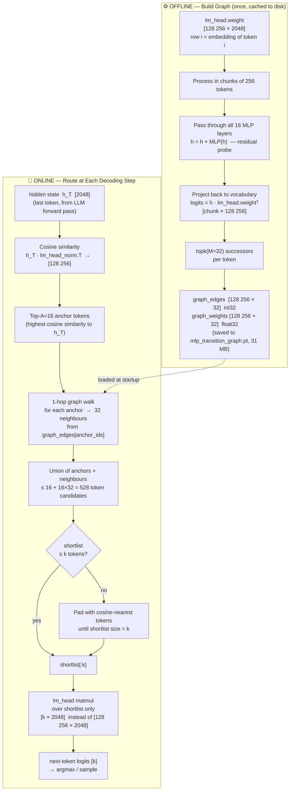

# MLP Transition Graph Router — Diagram

## Mermaid Source



---

## How it works — plain English

### Phase 1: Offline graph construction

Each of the 128,256 vocabulary tokens has a corresponding row in `lm_head.weight` — its "output embedding". We treat this vector as a synthetic hidden state and pass it through all 16 MLP layers of the transformer as a **residual stream probe**:

```
h = lm_head.weight[i]          # token i's output embedding, shape [2048]
for each MLP layer:
    h = h + MLP(h)             # residual update, same as transformer forward
logits = h @ lm_head.weight.T  # project back to vocabulary
successors[i] = topk(logits, k=32)  # which tokens tend to follow token i?
```

This encodes a **learned co-occurrence prior**: tokens whose MLP activations produce similar intermediate representations cluster together as likely successors.

### Phase 2: Online routing (each decoding step)

Given the current hidden state `h_T`:

1. **Anchor selection** — find the 16 vocabulary tokens most similar to `h_T` by cosine similarity with `lm_head.weight`. These are the tokens the model currently "thinks" are likely.
2. **Graph walk** — for each anchor token, look up its 32 pre-computed successors in the graph. This gives up to 16 × 32 = 512 candidates.
3. **Union** — merge anchors and neighbours into a shortlist. If the union is smaller than the target shortlist size `k`, pad with additional cosine-nearest tokens.
4. **Pruned lm_head** — run `lm_head` only over the shortlist, reducing the matmul from `[128256 × 2048]` to `[k × 2048]`.

### Key insight

The MLP layers act as a **transition function** — they encode which output tokens are reachable from a given intermediate representation. By probing each token's embedding through all MLP layers offline, we pre-compute a vocabulary-space graph that captures semantic and syntactic co-occurrence structure without any additional training.
